# Microservices Banking App - DevOps Documentation

This document details all DevOps-related steps and processes performed for the **Microservices Banking App** project from Phase 0 to Phase 3. It includes cluster setup, Docker images, Kubernetes manifests, and configurations.

---

## **Project Folder Structure**

The folder structure of the project including manifests, Dockerfiles, and configuration files:

```mermaid
graph TD
  A[microservices-banking-app] --> B[user_service]
  A --> C[account_service]
  A --> D[transaction_service]
  A --> E[notification_service]
  A --> F[frontend]
  A --> G[k8s]
  
  G --> H[namespace]
  H --> H1[microservices.yaml]
  H --> H2[cicd.yaml]
  H --> H3[monitoring.yaml]
  H --> H4[logging.yaml]

  G --> I[manifests]
  
  I --> I1[common]
  I1 --> I1a[serviceaccount.yaml]
  I1 --> I1b[pvc-claim.yaml]
  
  I --> I2[user-service]
  I2 --> I2a[deployment.yaml]
  I2 --> I2b[service.yaml]
  I2 --> I2c[configmap.yaml]
  I2 --> I2d[ingress-path.yaml]  

  I --> I3[account-service]
  I3 --> I3a[deployment.yaml]
  I3 --> I3b[service.yaml]
  I3 --> I3c[configmap.yaml]
  I3 --> I3d[ingress-path.yaml]

  I --> I4[transaction-service]
  I4 --> I4a[deployment.yaml]
  I4 --> I4b[service.yaml]
  I4 --> I4c[configmap.yaml]
  I4 --> I4d[ingress-path.yaml]

  I --> I5[notification-service]
  I5 --> I5a[deployment.yaml]
  I5 --> I5b[service.yaml]
  I5 --> I5c[configmap.yaml]
  I5 --> I5d[ingress-path.yaml]

  I --> I6[frontend]
  I6 --> I6a[deployment.yaml]
  I6 --> I6b[service.yaml]
  I6 --> I6c[configmap.yaml]
  I6 --> I6d[nginx.conf]
```

Phase 0 — Base Project Setup
Goals:

Prepare project structure.

Separate Dockerfiles for each service and frontend.

Ensure service versions are compatible with current Python and Node versions.

Actions Completed:

Verified Python version for backend services:
python3 --version
# Python 3.12.3

Verified Node version for frontend:

Node 20, React 19.2.0

Created Dockerfiles for each service and frontend with correct versions.

Phase 1 — Kubernetes Cluster Setup
Goals:

Deploy a KIND cluster with control-plane and worker nodes.

Create namespaces for microservices, CI/CD, monitoring, and logging.

Configure default network policies.

Actions Completed:

Cluster creation:

kind create cluster --name banking-app --config kind-config.yaml
Nodes:

1 control-plane

2 workers

Namespaces created: microservices, cicd, monitoring, logging, plus default ones.

Network policies: Default deny-all applied in microservices namespace.

Namespace YAMLs:

Each namespace defined separately in k8s/namespace/.

Phase 2 — Docker Images
Goals:

Build Docker images for all backend services and frontend with correct Python and Node versions.

Push images to DockerHub.

Actions Completed:

Dockerfiles updated:

Python services: python:3.12-slim

Frontend: node:20 → build → nginx:alpine

Nginx configuration for frontend: nginx.conf in k8s/manifests/frontend/

Docker image builds:

docker build -t inam101001/user-service:dev -f user_service/Dockerfile .
docker build -t inam101001/account-service:dev -f account_service/Dockerfile .
docker build -t inam101001/transaction-service:dev -f transaction_service/Dockerfile .
docker build -t inam101001/notification-service:dev -f notification_service/Dockerfile .
docker build -t inam101001/frontend:dev -f frontend/Dockerfile frontend/
Docker images pushed to DockerHub.

Phase 3 — Kubernetes Manifests for Microservices
Goals:

Deploy backend services, frontend, and common resources using Kubernetes manifests.

Include Deployments, Services, ConfigMaps, PVCs, and ServiceAccounts.

3.1 Common Resources
ServiceAccount: microservices-sa in k8s/manifests/common/serviceaccount.yaml

PVC template: k8s/manifests/common/pvc-claim.yaml

3.2 Microservices Deployment Pattern
For each backend service (user-service, account-service, transaction-service, notification-service):

Files per service:

deployment.yaml

service.yaml

configmap.yaml

ingress-path.yaml (optional for future ingress)

Frontend Deployment:

ClusterIP service

Container: inam101001/frontend:dev

Nginx serves React build (nginx.conf)

3.3 ConfigMaps
Created for each backend service:

user-service/configmap.yaml

account-service/configmap.yaml

transaction-service/configmap.yaml

notification-service/configmap.yaml

3.4 Deployment Architecture Diagram
mermaid
Copy code
graph LR
  A[User-Service Pod] -->|API| B[Account-Service Pod]
  B -->|API| C[Transaction-Service Pod]
  A -->|Notification| D[Notification-Service Pod]
  E[Frontend Pod] -->|HTTP Requests| A
  E -->|HTTP Requests| B
  E -->|HTTP Requests| C
  D -->|Sends Emails/SMS| User
3.5 Cluster Architecture Diagram
mermaid
Copy code
graph TD
  subgraph Control Plane
    CP[kube-apiserver + controller-manager + scheduler + etcd]
  end

  subgraph Worker Nodes
    N1[user-service pod, account-service pod]
    N2[transaction-service pod, notification-service pod]
    N3[frontend pod, monitoring pods]
  end

  CP --> N1
  CP --> N2
  CP --> N3
3.6 Deployment Flow Diagram
mermaid
Copy code
graph TD
  Code[Source Code] --> Docker[Docker Build]
  Docker --> DockerHub[Push to DockerHub]
  DockerHub --> Kubernetes[Apply Manifests]
  Kubernetes --> Pods[Pods Running Services]
  Pods --> Services[Services Expose Endpoints]
  Services --> Frontend[React Frontend Access API]
3.7 Applying Manifests

kubectl apply -f k8s/manifests/common/
kubectl apply -f k8s/manifests/user-service/
kubectl apply -f k8s/manifests/account-service/
kubectl apply -f k8s/manifests/transaction-service/
kubectl apply -f k8s/manifests/notification-service/
kubectl apply -f k8s/manifests/frontend/
Validation:

kubectl get pods -n microservices
kubectl get svc -n microservices
kubectl get configmap -n microservices
kubectl get pvc -n microservices
✅ Summary of Completed Tasks
Project structure, Dockerfiles, and images (Phase 0–2)

Kubernetes cluster, namespaces, network policies (Phase 1)

Kubernetes manifests: Deployments, Services, ConfigMaps, PVCs, ServiceAccounts (Phase 3)

Frontend Nginx configuration and Docker build

Docker images pushed to DockerHub